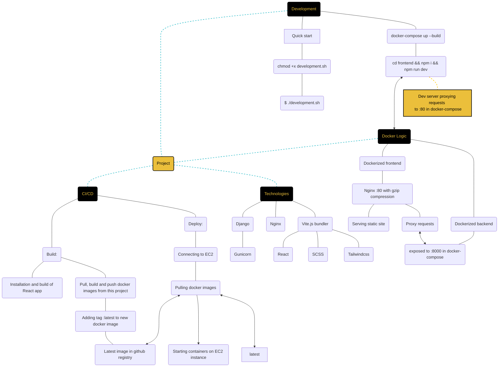

# TODO App
<a href="https://ec2-18-189-69-172.us-east-2.compute.amazonaws.com">🌐 Deployed project</a>
## Project Description
This project is a scalable TODO application built using Django for the backend and React with Vite.js for the frontend.

## Architecture
- Backend (Django)
- Frontend (React with Vite.js)
- Server (Nginx)

## Containerization (Docker Compose)
- Separate containers for the Django backend, React frontend

## Deployment
- GitHub Actions: Automates the deployment process using GitHub Actions for continuous integration and deployment.
- Docker Compose: Streamlines the deployment process by managing the containers for the frontend, backend, and Nginx server.
- Nginx Configuration: Optimized to serve the React application and proxy requests to the Django backend efficiently.

## Getting Started
### Prerequisites
- Docker
- Docker Compose
